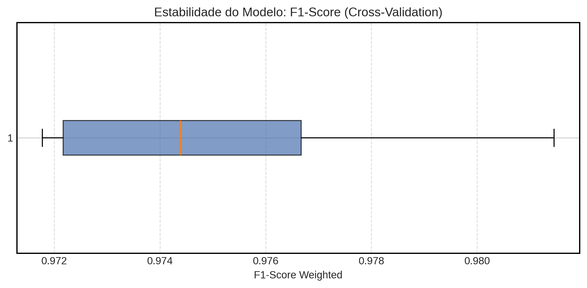
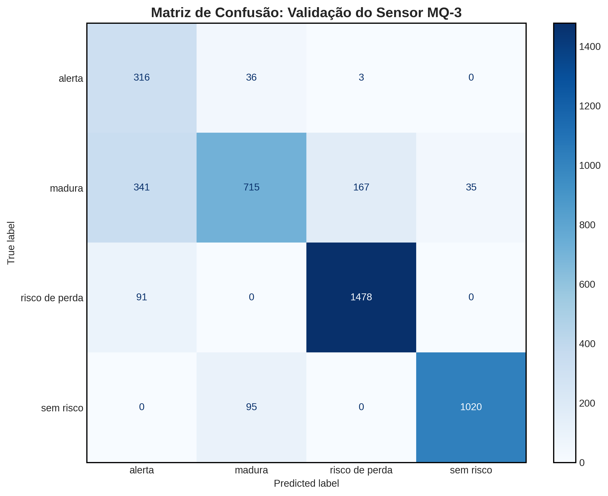
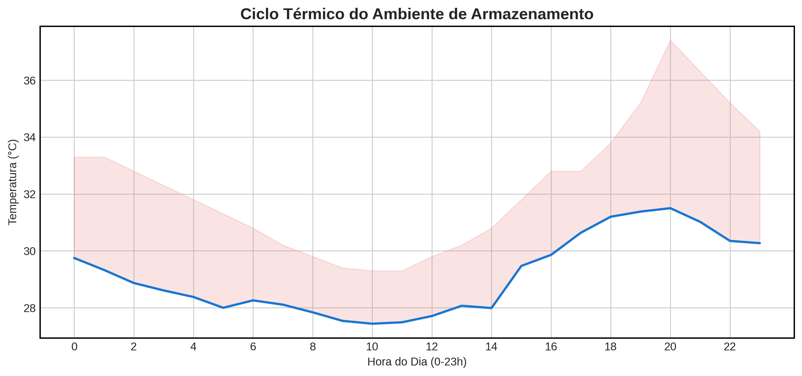
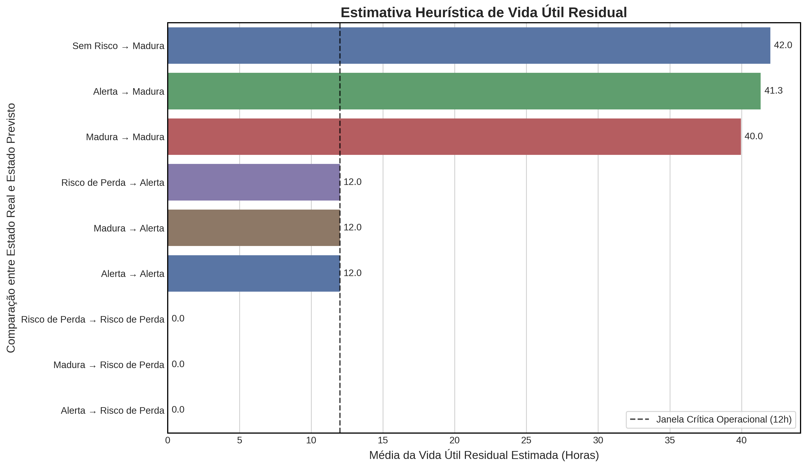

# Plataforma IoT de Baixo Custo para Predição de Maturação e Risco de Perda em Frutos Climatéricos
## Integração entre sensores químicos e análise preditiva para redução de desperdício em cadeias FLV

## Visão Geral do Projeto

Este projeto implementa a arquitetura proposta no artigo científico desenvolvido na **Faculdade SENAI Fatesg**. O foco é mitigar a ineficiência operacional no setor de Hortifrúti (FLV), que registra perdas de **5,83%** (base 2024), através de um sistema ciber-físico que monitora a liberação de compostos voláteis e variáveis ambientais.

O sistema foca em **frutos climatéricos**, que apresentam pico respiratório e liberação acelerada de Etileno ($C_2H_4$) durante a maturação. O monitoramento contínuo permite identificar variações nos compostos voláteis liberados pela fruta, e fornecer o contexto ambiental pela temperatura e umidade para reduzir interferências e interpretar corretamente seu estábio biológico e uma validade para margem de venda ideal.

* frutas em estado **“Sem Risco”** não recebem previsão imediata de descarte;
* frutas **“Maduras”** possuem validade dinâmica ajustada conforme temperatura e umidade;
* estados de **“Alerta”** indicam curta janela logística restante;
* frutas em **“Risco de Perda”** recebem validade nula, indicando inviabilidade comercial.

### Frutas de Estudo (Casos Climatéricos):
* **Banana** 

---

## Metodologia e Tecnologias Aplicadas:
---

### Camada de Aquisição (Edge Computing)

O nó sensor foi desenvolvido com base no microcontrolador ESP32, responsável pela aquisição contínua dos dados ambientais e químicos relacionados ao amadurecimento das frutas climatéricas.

#### Sensoriamento Ambiental e Químico

* **MQ-3 (Pino 34)**  
  Utilizado como proxy para detecção de compostos voláteis liberados durante o metabolismo da fruta, especialmente o aumento associado à emissão de etileno em estágios avançados de maturação.

* **DHT11 (Pino 19)**  
  Responsável pelo monitoramento de temperatura e umidade relativa do ar, variáveis diretamente relacionadas à aceleração do processo climatérico e à degradação pós-colheita.

#### Processamento Local do Sinal

O sistema aplica um modelo de filtragem baseado em **Média Móvel Exponencial (EMA)** para reduzir ruídos térmicos e oscilações elétricas do sensor MQ-3.

* **100 leituras sequenciais** são realizadas ao longo de aproximadamente **3,75 minutos**; O fator de suavização **α = 0.05** prioriza estabilidade sem perder sensibilidade a mudanças graduais no ambiente; O sinal final enviado ao servidor corresponde ao valor suavizado do sensor, reduzindo falsos picos de leitura.

Essa abordagem permitiu manter a variabilidade do sinal em níveis estáveis durante o monitoramento contínuo.

#### Ciclo Temporal de Coleta

O firmware opera em um ciclo fixo de **300 segundos (5 minutos)** entre cada transmissão.

Durante cada ciclo:

1. O ESP32 realiza a leitura do DHT11;
2. Executa o filtro EMA no MQ-3;
3. Estrutura os dados em formato JSON;
4. Envia as informações para a API Flask via HTTP POST.

A consistência temporal observada no dataset validou a estabilidade do pipeline de aquisição, reduzindo lacunas temporais e garantindo integridade para análise estatística e aprendizado de máquina.

#### Estrutura das Variáveis Monitoradas
##### Essas variáveis compõem a base utilizada pelo sistema de inferência climatérica e pela análise preditiva de risco de perda.
Cada amostra enviada contém:

* Tipo da fruta (`banana`);
* Temperatura ambiente;
* Umidade relativa;
* Valor bruto do MQ-3 (`mq3_raw`);
* Conversão elétrica do MQ-3 (`mq3_tensao`);
* Identificação do lote monitorado;
* Estado biológico observado (`estado_real`).

--- 
### Camada de Inteligência (IA e Analytics)

Os dados coletados pelo ESP32 são processados por uma camada híbrida de inferência composta por heurísticas climatéricas, análise estatística e modelos de Machine Learning voltados ao monitoramento pós-colheita.

#### Classificação Climatérica (Rule-Based)

O sistema utiliza uma lógica heurística baseada na concentração de gases detectada pelo sensor MQ-3 para inferir automaticamente o estágio biológico da banana.

Os limiares de classificação foram calibrados empiricamente a partir do comportamento observado nos lotes monitorados:

| MQ-3 Raw (ADC) | Estado Previsto |
|---|---|
| `< 1900` | Sem Risco |
| `1900 – 2600` | Madura |
| `2600 – 3100` | Alerta |
| `> 3100` | Risco de Perda |

Essa abordagem permite identificar transições climatéricas em tempo real, transformando leituras químicas em estados operacionais compreensíveis para logística e gestão de estoque.

#### Estimativa Heurística de Vida Útil

Além da classificação, o sistema calcula automaticamente uma estimativa de validade residual baseada nas condições ambientais.

A lógica considera o **aumento de temperatura** como acelerador metabólico; **alta umidade relativa** como fator de degradação; **Concentração elevada de gases** como indicador de avanço climatérico.

As estimativas aplicadas são:

* **Sem Risco** → sem previsão imediata de descarte;
* **Madura** → validade dinâmica de até 48 horas;
* **Alerta** → janela logística reduzida para 12 horas;
* **Risco de Perda** → validade nula (0h).

O modelo reduz automaticamente a vida útil estimada quando:
* temperatura > 32°C;
* umidade relativa > 78%.

#### Machine Learning e Validação Estatística

Após o saneamento e auditoria lógica do dataset, os dados foram utilizados para validação estatística utilizando algoritmos de aprendizado supervisionado.

* **Random Forest Classifier**  
  Utilizado para classificação dos estados climatéricos:
  `Sem Risco`, `Madura`, `Alerta` e `Risco de Perda`.

* **Validação Cruzada (K-Fold)**  
  Aplicada para medir estabilidade e capacidade de generalização do modelo.

* **Métricas Avaliadas**
  * F1-Score Weighted;
  * Recall;
  * Precisão;
  * Matriz de Confusão.

Os resultados demonstraram elevada robustez na identificação de estados críticos de deterioração, especialmente na classe `Risco de Perda`.

### Pipeline Analítico e Engenharia de Dados

O backend realiza processos automáticos de limpeza, agregação temporal e engenharia de atributos.

#### Etapas aplicadas:

* Conversão tipada de variáveis numéricas;
* Correção de valores ausentes (`forward fill` e `backfill`);
* Reamostragem temporal em janelas de 30 minutos;
* Cálculo de inclinação temporal (`mq3_slope`) para análise de tendência de emissão gasosa;
* Exportação automatizada para CSV analítico.

### Análise Temporal e Tendência

O sistema também implementa análise de tendência utilizando Regressão Linear sobre séries temporais do MQ-3.

Essa análise permite identificar:

* aceleração do amadurecimento;
* estabilidade climatérica;
* tendência crescente de degradação;
* comportamento residual de emissão de gases.

---

### Stack Tecnológica

#### Linguagens
* `C++` (Arduino IDE)
* `Python 3.12`

#### Backend e Comunicação
* `Flask`
* `Flask-SocketIO`
* `HTTP REST API`

#### Inteligência Artificial e Analytics
* `Scikit-Learn`
* `Pandas`
* `NumPy`

#### Banco de Dados
* `MongoDB`
* `PostgreSQL` (camada analítica e consultas SQL)

#### Infraestrutura
* `ESP32`
* `Wi-Fi 2.4GHz`
* `JSON over HTTP`

### Estrutura do Projeto

├──data
├──IoT
├──modelos
├──static
├──.gitignore
├──README.MD
├──requirements.txt

---

## Instalação e Configuração

### Requisitos de Hardware

* **ESP32 DevKit V1** — responsável pela aquisição contínua dos dados e transmissão via Wi-Fi.
* **Sensor MQ-3** — utilizado como proxy para detecção de compostos voláteis associados à emissão de etileno em bananas climatéricas.

  * Pré-aquecimento mínimo de **24 horas** para estabilização da resistência interna e redução de drift analógico.
  * Operação com suavização via **Exponential Moving Average (EMA)** em 100 leituras distribuídas ao longo de ~3,75 minutos.
* **Sensor DHT11** — monitoramento ambiental de temperatura e umidade relativa do ar.

### Configuração do Ambiente

* **Servidor Flask + MongoDB** executando em workstation local para:

  * recepção dos dados via API REST;
  * armazenamento temporal das leituras;
  * classificação heurística em tempo real;
  * exportação e saneamento analítico dos datasets.

* **Variáveis de Ambiente (`.env`)**

  * Configuração da URI do MongoDB;
  * definição da `API_KEY`;
  * sincronização segura entre firmware ESP32 e backend Flask.

* **Pipeline Temporal**

  * Intervalo fixo de coleta de **300 segundos (5 minutos)**;
  * variabilidade operacional observada entre **294s e 306s**, considerada adequada para aplicações IoT em ambiente real;
  * ausência de gaps críticos na série temporal após validação estatística.

---

## Resultados Obtidos

### Desempenho Estatístico do Modelo

Após o saneamento lógico e auditoria dos dados:

* **F1-Score médio:** `0.9753`
* **Desvio padrão:** `± 0.0071`
* **Acurácia global:** `82%`
* **Weighted F1-Score:** `0.83`

Os resultados demonstram elevada estabilidade do modelo mesmo sob validação cruzada estratificada (K-Fold), indicando boa capacidade de generalização em diferentes subconjuntos do dataset.

### Desempenho por Estado Biológico

* **Risco de Perda**

  * Recall: `0.94`
  * F1-Score: `0.92`
  * Alta eficiência na detecção precoce de deterioração.

* **Sem Risco**

  * Precisão: `0.97`
  * F1-Score: `0.94`
  * Baixa incidência de falsos positivos.

* **Alerta**

  * Recall elevado (`0.89`), demonstrando comportamento preventivo do sistema.

### Correlação Sensorial e Ambiental

As análises confirmaram correlação direta entre:

* aumento da temperatura;
* aceleração metabólica da banana;
* crescimento dos valores do MQ-3.

Durante os ciclos monitorados:

* elevações térmicas acima de **32°C** aceleraram significativamente a emissão de compostos voláteis;
* níveis elevados de umidade (>78%) reduziram a estimativa de vida útil residual;
* leituras do MQ-3 apresentaram progressão coerente entre os estágios:
  `Sem Risco → Madura → Alerta → Risco de Perda`.

### Estimativa Heurística de Vida Útil

A validade residual foi inferida automaticamente com base na combinação entre:

* estágio biológico previsto;
* temperatura ambiente;
* umidade relativa do ar.

Regras aplicadas:

* `Madura` → até **48h** restantes;
* altas temperaturas e umidade reduzem a validade estimada;
* `Alerta` → aproximadamente **12h**;
* `Risco de Perda` → validade crítica (`0h`).

### Robustez do Pipeline IoT
.png)
O sistema ESP32 → Flask → MongoDB demonstrou:

* transmissão estável;
* sincronização temporal consistente;
* tolerância a pequenas oscilações de rede;
* capacidade de operação contínua sem perdas relevantes de pacotes.

### Aplicabilidade Prática

Os resultados validam a proposta como uma solução:

* de **baixo custo computacional e eletrônico**;
* escalável para pequenos centros de armazenamento;
* capaz de reduzir desperdícios pós-colheita através de alertas preventivos e monitoramento contínuo da maturação de bananas climatéricas.

## Contribuições

Este projeto foi desenvolvido pelos aludas do curso de *Inteligência Artificial* do 2° semestre na *SENAI FATESG* como trabalho de conclusão das disciplinas *(Internet das coisas / Projeto de Extensão Integrador)*.

* [@eopabro](https://www.linkedin.com/in/oipabro/) — **Pablo Henrique:** Desenvolvimento e Implementação do Código Embarcado, Integração Hardware-Software, Arquitetura de Aquisição IoT, Elaboração Conceitual do Projeto e Pesquisa de Campo.

* [@LucaAtanazio](https://www.linkedin.com/in/lucaatanazio/) — **Luca Atanazio:** Curadoria e Saneamento de Dados, Engenharia Analítica, Validação Estatística e Métricas de Machine Learning, Arquitetura do Sistema, Gerenciamento de Recursos e Aquisição de Hardware, Elaboração Conceitual do Projeto, Pesquisa de Campo e Apresentação Técnica.

---
### **Orientação Acadêmica**

O projeto foi concluído sob a direção dos professores:
* [Prof. Willgnner Ferreira Santos](https://github.com/Willgnner-Santos) *(Projeto de Extensão Integrador)*
* [Prof. Alisson Rodrigues](https://www.linkedin.com/in/alissonralves1/) *(Internet da Coisas)*

